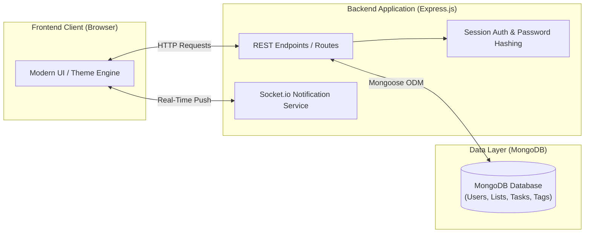
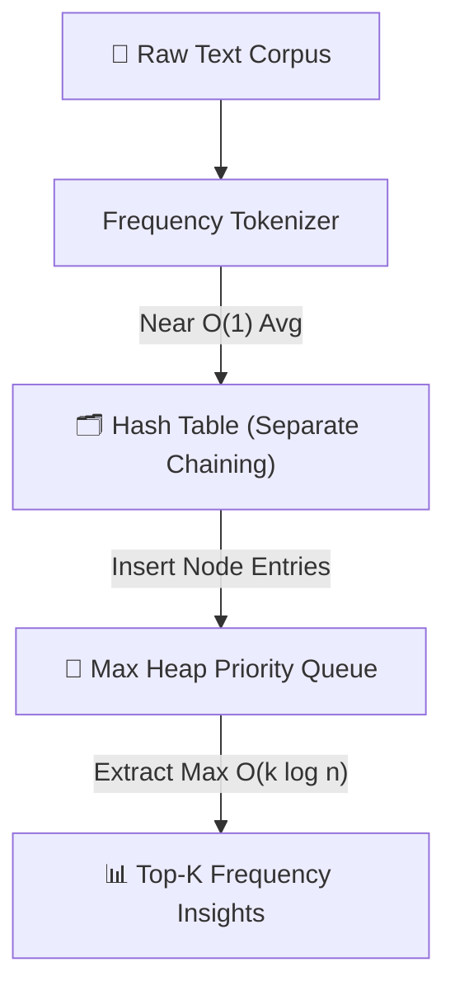

<div align="center">

# Nikhil Mundhra
### BSc in Computer Science with Economics & Applied Math — NYU Abu Dhabi
#### Global Coursework & Engineering Portfolio across NYU Abu Dhabi • NYU Paris • NYU Tandon • NYU CAS

<table border="0" cellpadding="10" cellspacing="0">
  <tr>
    <td align="center" colspan="3">
      <a href="https://nyuad.nyu.edu/">
        
      </a>
    </td>
  </tr>
  <tr>
    <td align="center">
      <a href="https://www.nyu.edu/paris.html">
        <picture>
          <source media="(prefers-color-scheme: dark)" srcset="./assets/nyu_paris_logo_dark.png">
          
        </picture>
      </a>
    </td>
    <td align="center">
      <a href="https://engineering.nyu.edu/">
        <picture>
          <source media="(prefers-color-scheme: dark)" srcset="./assets/nyu_tandon_logo_dark.png">
          
        </picture>
      </a>
    </td>
    <td align="center">
      <a href="https://cas.nyu.edu/">
        <picture>
          <source media="(prefers-color-scheme: dark)" srcset="./assets/nyu_cas_logo_dark.png">
          
        </picture>
      </a>
    </td>
  </tr>
</table>

[](https://www.linkedin.com/in/mundhra-nikhil/) [](https://github.com/Nikhil-Mundhra) [](mailto:nikhil.mundhra@nyu.edu) [](https://github.com/Nikhil-Mundhra/Learning)

<br />

*Welcome to my coursework and engineering portfolio! I am an undergraduate at **New York University Abu Dhabi** pursuing a **BSc in Computer Science with Economics & Applied Math** (Class of 2027), focusing on Machine Learning and Computer Security. This repository showcases my academic coursework, research, and software projects completed across NYU's global network — spanning **NYU Abu Dhabi**, study away at **NYU Paris**, and study away in New York across the **NYU Tandon School of Engineering** and **NYU College of Arts and Science (CAS)**.*

</div>

---

## 🏛️ Academic Background & Global Network

| Institution / Campus | Status & Program | Academic & Leadership Highlights |
| :--- | :--- | :--- |
| **🏛️ NYU Abu Dhabi** *(Degree Campus)* | **BSc in Computer Science with Economics & Applied Math** <br /> *Abu Dhabi, UAE • Aug 2023 – May 2027* | • **Focus Areas**: Machine Learning & Computer Security (Cumulative GPA: 3.5 / 4.0)<br />• **Research**: ML Researcher (Capstone) @ *NYUAD Center for Brain and Health* (3D CNN & U-Net microvascular segmentation on 3D DICOM retinal OCTA scans)<br />• **Campus Leadership**: Global Education Officer (*Office of Global Education*), Junior Year Experience Committee, President of *Mathematics SIG*, Founder & President of *Hindu Student Association (Peacock)*<br />• **Honors**: UAE Top 3 Adaptive City Hackathon Winner (@ Transpose), CEMC Waterloo CCC Distinction, NYUAD International QC Hackathon Nominee |
| **🇫🇷 NYU Paris** *(Study Away)* | **Global Study Away Semester** <br /> *Paris, France • Jan 2025 – May 2025* | • International study away immersion in France<br />• **Leadership**: Treasurer, *Code Paris* student organization |
| **🏙️ NYU Tandon** *(Study Away)* | **School of Engineering** <br /> *Brooklyn, NY • Fall 2025* | • Advanced systems, networking & security engineering:<br />&nbsp;&nbsp;– **Computer Security** (`CS3923-UG` / `6813-GY`) with Prof. Justin Cappos (Threat modeling, reference monitors, virtualization, exploit analysis)<br />&nbsp;&nbsp;– **Computer Networking** (`CS-UY 4793`) with Prof. Lucas O’Rourke (Wireshark packet analysis, transport/routing protocols)<br />&nbsp;&nbsp;– **Data Structures & Algorithms** (Custom C++ BST, Hash Table with Separate Chaining, Max Heap)<br />&nbsp;&nbsp;– **Computer Systems Organization (CSO)** (Low-level C programming, memory architectures, pointer arithmetic) |
| **🗽 NYU CAS** *(Study Away)* | **College of Arts and Science** <br /> *New York, NY • Fall 2025* | • Full-stack software engineering & core computer science:<br />&nbsp;&nbsp;– **Applied Internet Technology** (`CSCI-UA.0467`) — Full-stack MERN engineering ("Cool Reminders")<br />&nbsp;&nbsp;– **Operating Systems** (`CSCI-UA.0202`) — Concurrency, process scheduling, virtual memory paging, file systems<br />• **Leadership**: Alternate NYU Abu Dhabi Senator @ *NYU Student Government Assembly (SGA)*, New York |

---

## 🛠️ Tech Stack

### Languages
           

### Web & Full-Stack Engineering
        

### Databases & Cloud Platforms
      

### Tools, DevOps & Creative Tech
      

---

## 📌 Featured Projects

| Project | Domain / Campus | Stack | Highlights |
| :--- | :--- | :--- | :--- |
| [**Retinal OCTA Deep Learning**](https://github.com/Nikhil-Mundhra/OCT-Analyser-Capstone) | Computer Vision / ML <br /> *(NYUAD Capstone)* |    | Computer vision research at NYUAD Center for Brain and Health; end-to-end deep learning pipelines to preprocess 3D DICOM volumes and segment retinal microvascular features. |
| [**Cool Reminders**](./Applied%20Internet%20Technology/final-project-Nikhil-Mundhra) | Full-Stack Web App <br /> *(NYU CAS • CSCI-UA 467)* |     | Dynamic priority reminders, real-time WebSocket updates, subtasks, custom theming, and secure session authentication. |
| [**VivahGo Planners**](https://github.com/Nikhil-Mundhra/VivahGo-Mobile) | AI SaaS Platform <br /> *(Solo Founder)* |    | Full-stack architecture, backend, frontend UI/UX, and third-party integrations for an AI-driven wedding workspace platform. |
| [**SmogLife**](./Gamified%20Learning/SmogLife%20GameMaker) | Game Development <br /> *(NYU Abu Dhabi)* |  | 2D educational game raising environmental awareness with interactive gameplay mechanics and puzzle design. |
| [**Interactive Creative Computing**](./Interactive%20Media) | Creative Computing <br /> *(NYU Abu Dhabi)* |   | Generative art sketches and responsive interactive self-portrait built with the p5 canvas library. |
| [**Core Data Structures & Systems**](./Data_Structures) | Systems & DS <br /> *(NYU Tandon)* |   | Custom implementations of Binary Search Trees (BST), Max Heaps, and Hash Tables with collision resolution. |
| [**NYUAD QC Hackathon Showcase**](./NYUAD_QC_Hackathon) | Quantum Computing <br /> *(NYU Abu Dhabi)* |  | Quantum Computing Hackathon project exploration and nomination showcase at NYU Abu Dhabi. |

> 💼 **Other public projects** (outside this repo): [DeedFlow — AI Real Estate SaaS](https://github.com/Nikhil-Mundhra/DeedFlow) • [bid-nyuad — NYUAD Falcon Bidding Platform](https://github.com/Nikhil-Mundhra/bid-nyuad) • [run-ai-on-kaggle-free — Free GPU ML Backend](https://github.com/Nikhil-Mundhra/run-ai-on-kaggle-free) • [train-cnn-models — CNN Fine-Tuning Toolkit](https://github.com/Nikhil-Mundhra/train-cnn-models)

---

## 🚀 Deep Dives into Projects

### 1. Cool Reminders — Full-Stack Productivity & Task Engine
> **Path**: [`Applied Internet Technology/final-project-Nikhil-Mundhra`](./Applied%20Internet%20Technology/final-project-Nikhil-Mundhra)

A full-stack productivity web application designed to eliminate task clutter with structured hierarchies, real-time notifications, and personalized workflows:



- **Backend Architecture**: Express.js REST API with asynchronous ES Modules (`.mjs`), clean routing, and centralized database connection pooling.
- **Data Persistence**: MongoDB database modeled with Mongoose schemas for users, lists, hierarchical subtasks, tags, and settings.
- **Real-Time Communication**: Socket.io integration for instant client notification dispatch without polling.
- **Security & Auth**: Hashed credential management, session handling, input sanitation, and scoped user permissions.
- **Customization Engine**: Dynamic user preferences supporting custom theme colors, reminder offsets, and prioritized layout ordering.

---

### 2. SmogLife — Gamified Learning & Environmental Simulation
> **Path**: [`Gamified Learning/SmogLife GameMaker`](./Gamified%20Learning/SmogLife%20GameMaker)

An interactive 2D narrative game built to teach atmospheric science and pollution mitigation through playful mechanics:

<div align="center">
  
  <p><em>SmogLife Character Animation & Directional Sprite Sequence</em></p>
</div>

- **Dynamic Mechanics**: Multi-level game progression across custom rooms and obstacle challenges.
- **State Tracking**: Real-time environmental metrics, player energy systems, and win/loss trigger conditions.
- **Asset Pipeline**: Custom 2D pixel art, animated directional sprite engines, and immersive audio effects.

---

### 3. Core Data Structures & Systems Engineering
> **Path**: [`Data_Structures`](./Data_Structures) & [`CSO`](./CSO)

High-performance C and C++ software demonstrating foundational algorithmic complexity and memory models:



- **Library Circulation Management System (LCMS)**: Custom Binary Search Tree (BST) supporting dynamic insertions, deletions with successor replacement, and tree traversals in C++.
- **Frequency Analyzer**: Custom Hash Table paired with a Max Heap priority queue for high-speed top-$k$ statistical analysis.
- **Low-Level Systems (CSO)**: Pointer arithmetic, dynamic memory allocation (`malloc`/`free`), bit manipulation, and machine-level architecture in C.

---

### 4. Interactive Media & Creative Computing
> **Path**: [`Interactive Media`](./Interactive%20Media)

Creative programming projects exploring canvas manipulation and algorithmic graphics:
- **Interactive Self-Portrait**: Interactive sketch rendering dynamic geometry responding to user inputs and cursor movements.
- **Generative Sketches**: Algorithmic rendering and animation with p5.js.

---

## 📂 Repository Organization

```text
.
├── assets/                          # Authentic institution logos & project media
│   ├── nyuad_logo.svg               # Official NYU Abu Dhabi logo
│   ├── nyu_paris_logo.png           # Official NYU Paris lockup logo
│   ├── nyu_tandon_logo.png          # Official NYU Tandon School of Engineering logo
│   ├── nyu_cas_logo.png             # Official NYU College of Arts & Science logo
│   └── smoglife-sprites.webp        # SmogLife character animation sheet
├── Applied Internet Technology/     # Full-stack web engineering (NYU CAS • CSCI-UA.0467)
│   ├── final-project-Nikhil-Mundhra # "Cool Reminders" flagship full-stack MERN web app
│   ├── homework01-Nikhil-Mundhra    # Interactive CLI Tic-Tac-Toe engine
│   ├── homework02-Nikhil-Mundhra    # Express web server & data visualization
│   ├── homework03-Nikhil-Mundhra    # Client-server web app
│   └── Practice/                    # React, Socket.io, AJAX, and auth prototypes
├── Gamified Learning/               # Game design & educational tech (NYU Abu Dhabi)
│   └── SmogLife GameMaker/          # Full GameMaker Studio game project
├── Interactive Media/               # Creative coding & p5.js sketches (NYU Abu Dhabi)
│   ├── Self-portrait/               # Interactive graphical self-portrait
│   └── Ambitious manta_*/           # Generative canvas exploration
├── Data_Structures/                 # C++ data structures & memory management (NYU Tandon)
│   ├── Assignment2/                 # Binary Search Tree library system (lcms)
│   └── Assignment3/                 # Hash Table & Max Heap word analyzer
├── CSO/                             # Computer Systems Organization in C (NYU Tandon)
│   ├── HW2/                         # Bit-level operations & machine architecture
│   └── Recitations/                 # Systems programming exercises & pointer manipulation
├── Algorithms/                      # Algorithm analysis & design problem sets (NYU Tandon)
├── Operating Systems/               # OS concepts, processes, concurrency & memory (NYU CAS • CS 202)
├── Computer Networking/             # Networking protocols & layer architectures (NYU Tandon • CS-UY 4793)
├── Computer Security/               # Information security, privacy & cryptography (NYU Tandon • CS 3923)
├── NYUAD_QC_Hackathon/              # Quantum computing hackathon project & showcase (NYU Abu Dhabi)
└── java/                            # Java object-oriented programming foundations
```

---

## 🛠️ Getting Started & Local Setup

### Running "Cool Reminders" (Full-Stack Web App)
```bash
cd "Applied Internet Technology/final-project-Nikhil-Mundhra"
npm install
# Ensure MongoDB is running locally (e.g., mongodb://localhost:27017)
# or set DSN in your .env file:
# DSN=mongodb://localhost:27017/cool-reminders
npm start
```

### Running Data Structures Projects (C++)
```bash
# Example: Binary Search Tree Library System
cd "Data_Structures/Assignment2/nm4358"
g++ -std=c++11 -Wall *.cpp -o lcms
./lcms

# Example: Hash Table & Max Heap Word Counter
cd "Data_Structures/Assignment3/nm4358"
g++ -std=c++11 -Wall *.cpp -o wordcount
./wordcount
```

### Running Interactive Media (p5.js)
Open `Interactive Media/Self-portrait/index.html` directly in any modern web browser or serve via:
```bash
npx serve "Interactive Media/Self-portrait"
```

---

## 📫 Connect With Me

| Platform | Link |
|---|---|
| 💼 LinkedIn | [linkedin.com/in/mundhra-nikhil](https://www.linkedin.com/in/mundhra-nikhil/) |
| 🐙 GitHub | [github.com/Nikhil-Mundhra](https://github.com/Nikhil-Mundhra) |
| 📧 Email (NYU) | [nikhil.mundhra@nyu.edu](mailto:nikhil.mundhra@nyu.edu) |
| 📧 Email (Personal) | [nikhilmundhra28@gmail.com](mailto:nikhilmundhra28@gmail.com) |
| 📍 Primary Location | Abu Dhabi, UAE • New York, USA |
