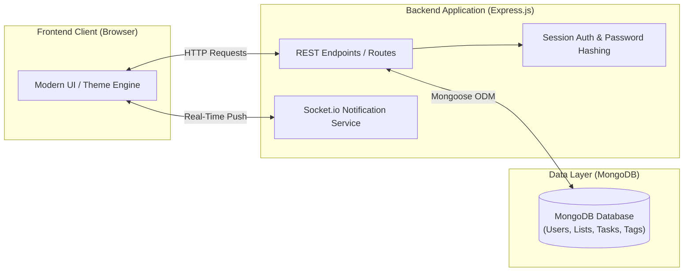
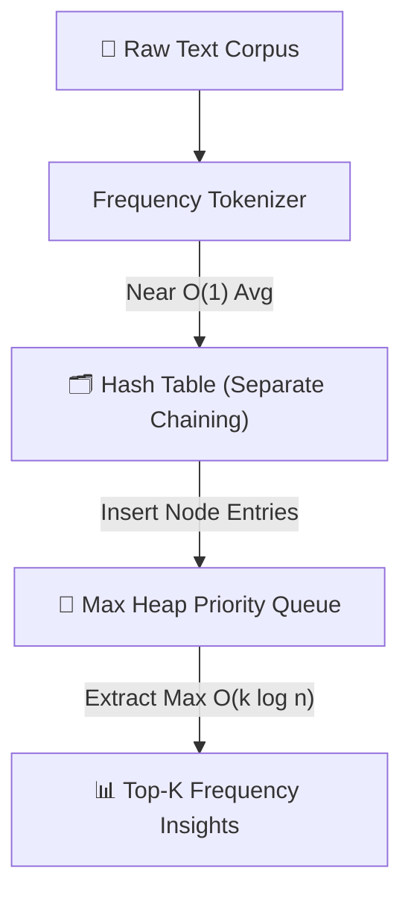

<div align="center">


# Nikhil Mundhra
### Software Engineering & Computer Science Portfolio

[](https://www.linkedin.com/in/mundhra-nikhil/)
[](https://github.com/Nikhil-Mundhra)
[](mailto:nikhilmundhra28@gmail.com)
[](https://engineering.nyu.edu/)

<br />

*Welcome to my coursework and engineering portfolio. This repository showcases my full-stack web applications, game engines, interactive creative computing, and low-level systems & data structures work from NYU Tandon and independent learning.*

</div>

---

## 🛠️ Tech Stack

### Languages


### Backend & Web Engineering


### Databases


### Tools & Creative Tech


---

## 📌 Featured Projects

| Project | Domain | Stack | Highlights |
| :--- | :--- | :--- | :--- |
| [**Cool Reminders**](./Applied%20Internet%20Technology/final-project-Nikhil-Mundhra) | Full-Stack Web App |     | Dynamic priority reminders, real-time WebSocket updates, subtasks, custom theming, and secure session authentication. |
| [**SmogLife**](./Gamified%20Learning/SmogLife%20GameMaker) | Game Development |  | 2D educational game raising environmental awareness with interactive gameplay mechanics and puzzle design. |
| [**Interactive Creative Computing**](./Interactive%20Media) | Creative Computing |   | Generative art sketches and responsive interactive self-portrait built with the p5 canvas library. |
| [**Core Data Structures & Algorithms**](./Data_Structures) | Systems & DS |   | Custom implementations of Binary Search Trees (BST), Max Heaps, and Hash Tables with collision resolution. |
| [**NYUAD QC Hackathon Showcase**](./NYUAD_QC_Hackathon) | Quantum Computing |  | Quantum Computing Hackathon project exploration and nomination showcase at NYU Abu Dhabi. |

---

## 🚀 Deep Dives into Projects

### 1. Cool Reminders — Full-Stack Productivity & Task Engine
> **Path**: [`Applied Internet Technology/final-project-Nikhil-Mundhra`](./Applied%20Internet%20Technology/final-project-Nikhil-Mundhra)

A full-stack productivity web application designed to eliminate task clutter with structured hierarchies, real-time notifications, and personalized workflows:



- **Backend Architecture**: Express.js REST API with asynchronous ES Modules (`.mjs`), clean routing, and centralized database connection pooling.
- **Data Persistence**: MongoDB database modeled with Mongoose schemas for users, lists, hierarchical subtasks, tags, and settings.
- **Real-Time Communication**: Socket.io integration for instant client notification dispatch without polling.
- **Security & Auth**: Hashed credential management, session handling, input sanitation, and scoped user permissions.
- **Customization Engine**: Dynamic user preferences supporting custom theme colors, reminder offsets, and prioritized layout ordering.

---

### 2. SmogLife — Gamified Learning & Environmental Simulation
> **Path**: [`Gamified Learning/SmogLife GameMaker`](./Gamified%20Learning/SmogLife%20GameMaker)

An interactive 2D narrative game built to teach atmospheric science and pollution mitigation through playful mechanics:

<div align="center">
  
  <p><em>SmogLife Character Animation & Directional Sprite Sequence</em></p>
</div>

- **Dynamic Mechanics**: Multi-level game progression across custom rooms and obstacle challenges.
- **State Tracking**: Real-time environmental metrics, player energy systems, and win/loss trigger conditions.
- **Asset Pipeline**: Custom 2D pixel art, animated directional sprite engines, and immersive audio effects.

---

### 3. Core Data Structures & Systems Engineering
> **Path**: [`Data_Structures`](./Data_Structures) & [`CSO`](./CSO)

High-performance C and C++ software demonstrating foundational algorithmic complexity and memory models:



- **Library Circulation Management System (LCMS)**: Custom Binary Search Tree (BST) supporting dynamic insertions, deletions with successor replacement, and tree traversals in C++.
- **Frequency Analyzer**: Custom Hash Table paired with a Max Heap priority queue for high-speed top-$k$ statistical analysis.
- **Low-Level Systems (CSO)**: Pointer arithmetic, dynamic memory allocation (`malloc`/`free`), bit manipulation, and machine-level architecture in C.

---

### 4. Interactive Media & Creative Computing
> **Path**: [`Interactive Media`](./Interactive%20Media)

Creative programming projects exploring canvas manipulation and algorithmic graphics:
- **Interactive Self-Portrait**: Interactive sketch rendering dynamic geometry responding to user inputs and cursor movements.
- **Generative Sketches**: Algorithmic rendering and animation with p5.js.

---

## 📂 Repository Organization

```text
.
├── assets/                          # Authentic institution logos & project media
│   ├── nyu_tandon_logo.png          # Official NYU Tandon School of Engineering logo
│   ├── nyuad_logo.svg               # Official NYU Abu Dhabi logo
│   └── smoglife-sprites.webp        # SmogLife character animation sheet
├── Applied Internet Technology/     # Full-stack web engineering
│   ├── final-project-Nikhil-Mundhra # "Cool Reminders" flagship full-stack web app
│   ├── homework01-Nikhil-Mundhra    # Interactive CLI Tic-Tac-Toe engine
│   ├── homework02-Nikhil-Mundhra    # Express web server & data visualization
│   ├── homework03-Nikhil-Mundhra    # Client-server web app
│   └── Practice/                    # React, Socket.io, AJAX, and auth prototypes
├── Gamified Learning/               # Game design & educational tech
│   └── SmogLife GameMaker/          # Full GameMaker Studio game project
├── Interactive Media/               # Creative coding & p5.js sketches
│   ├── Self-portrait/               # Interactive graphical self-portrait
│   └── Ambitious manta_*/           # Generative canvas exploration
├── Data_Structures/                 # C++ data structures & memory management
│   ├── Assignment2/                 # Binary Search Tree library system (lcms)
│   └── Assignment3/                 # Hash Table & Max Heap word analyzer
├── CSO/                             # Computer Systems Organization in C
│   ├── HW2/                         # Bit-level operations & machine architecture
│   └── Recitations/                 # Systems programming exercises & pointer manipulation
├── Algorithms/                      # Algorithm analysis & design problem sets
├── Operating Systems/               # OS concepts, processes, concurrency & memory
├── Computer Networking/             # Networking protocols & layer architectures
├── Computer Security/               # Information security, privacy & cryptography
├── NYUAD_QC_Hackathon/              # Quantum computing hackathon project & showcase
└── java/                            # Java object-oriented programming foundations
```

---

## 🛠️ Getting Started & Local Setup

### Running "Cool Reminders" (Full-Stack Web App)
```bash
cd "Applied Internet Technology/final-project-Nikhil-Mundhra"
npm install
# Ensure MongoDB is running locally (e.g., mongodb://localhost:27017)
# or set DSN in your .env file:
# DSN=mongodb://localhost:27017/cool-reminders
npm start
```

### Running Data Structures Projects (C++)
```bash
# Example: Binary Search Tree Library System
cd "Data_Structures/Assignment2/nm4358"
g++ -std=c++11 -Wall *.cpp -o lcms
./lcms

# Example: Hash Table & Max Heap Word Counter
cd "Data_Structures/Assignment3/nm4358"
g++ -std=c++11 -Wall *.cpp -o wordcount
./wordcount
```

### Running Interactive Media (p5.js)
Open `Interactive Media/Self-portrait/index.html` directly in any modern web browser or serve via:
```bash
npx serve "Interactive Media/Self-portrait"
```

---

## 📫 Connect With Me

| Platform | Link |
|---|---|
| 💼 LinkedIn | [linkedin.com/in/mundhra-nikhil](https://www.linkedin.com/in/mundhra-nikhil/) |
| 🐙 GitHub | [github.com/Nikhil-Mundhra](https://github.com/Nikhil-Mundhra) |
| 📧 Email | [nikhilmundhra28@gmail.com](mailto:nikhilmundhra28@gmail.com) |
